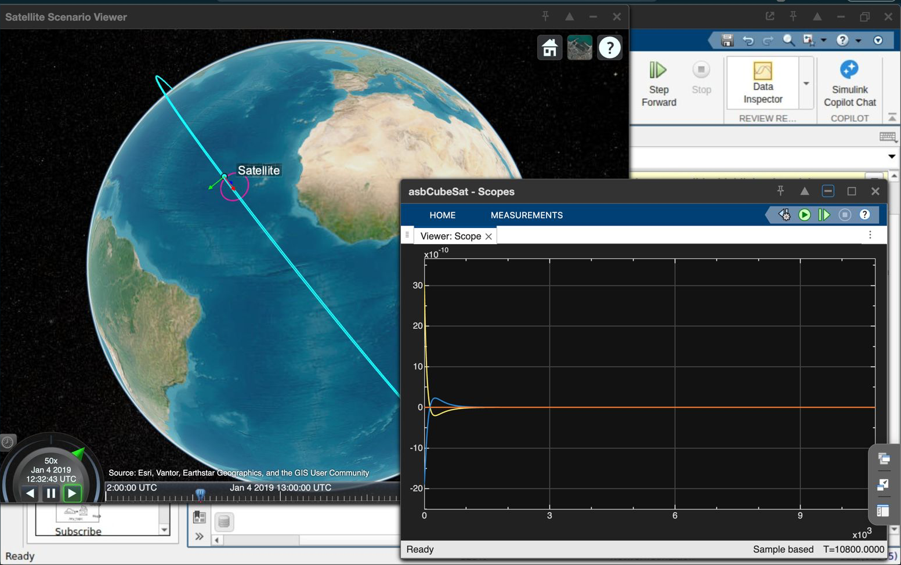

# ICARUS ADCS Demo

This repository contains the MATLAB and Simulink implementation developed for the ICARUS ADCS demonstration. The work currently covers the initial CubeSat simulation setup from Day 1 and the first disturbance-torque feature implemented on Day 2.

The model is built around the MATLAB Aerospace Blockset CubeSat simulation framework and is intended to provide a working simulation environment for developing and validating ADCS behavior. 

## Project Overview

The objective of this demo is to progressively extend the standard CubeSat simulation into an ADCS-focused simulation that can represent realistic spacecraft disturbances, sensor behavior, detumbling, and eventually autonomous pointing.

The development is being carried out incrementally so that every major feature is first integrated into a working simulation before the next subsystem is added.


 

The image displays the current state of the simulation, external GGT has been added and the simulation runs successfully following a low Earth Orbit propagation 
and Nadir-pointing. The scoped graph is set against the output of the GGT block and runs in parallel with the simulation. 

## Day 1: CubeSat Simulation Setup

Day 1 focused on establishing a working CubeSat simulation using the MATLAB Aerospace Blockset CubeSat example.

The standard top-level `asbCubeSat` model was configured and verified successfully.

### Day 1 Work Completed

- Set up the MATLAB Aerospace Blockset CubeSat simulation.
- Configured the mission for a Low Earth Orbit.
- Configured the spacecraft orbit and attitude parameters.
- Verified that the model runs successfully.
- Verified the spacecraft attitude behavior using the built-in visualization.
- Confirmed that the spacecraft follows the configured nadir-pointing behavior.

The resulting simulation provides the baseline spacecraft dynamics, environment, vehicle model, control interfaces, sensors, actuators, and visualization required for the later ADCS work.

## Current Model Architecture

The main `asbCubeSat` model contains the following major sections:

- Environment
- CubeSat Vehicle Model
- Mission Configuration
- Visualization
- Satellite Scenario Playback

Inside the Vehicle Model, the relevant subsystems are:

- Flight Software
- Plant Model
- Vehicle Flight Software
- Vehicle Control Actuators
- Vehicle Dynamics
- Vehicle Control Sensors

The vehicle flight software sends actuator commands to the actuator model. The resulting forces and torques are passed into the spacecraft dynamics model, while spacecraft states are returned to the sensor system and the top-level visualization.

### Model Architecture Placeholder

Place the current Simulink architecture screenshot at:

`src/cubesat_simulation_architecture.png`

Then the image will appear here:


## Day 2: Disturbance Torque Implementation

The first Day 2 feature is the explicit implementation of a gravity-gradient disturbance torque.

The purpose of this addition is to introduce an external environmental torque into the spacecraft dynamics while keeping the disturbance as a separate, clearly identifiable subsystem.

### Torque Path

The original actuator torque path was extended with a Sum block:

```text
Vehicle Control Actuators
            |
            | Torques
            v
          +---+
GGT ----> | SUM | ----> Moments
          +---+
```

The Sum block is configured for addition of the actuator torque and disturbance torque.

This allows additional disturbance sources to be added later without restructuring the existing spacecraft dynamics interface.

## Custom Gravity-Gradient Torque

A custom MATLAB Function block named `Gravity Gradient Torque` was added to the Vehicle Model.

The function receives two spacecraft state signals:

- `X_ecef`: spacecraft position in the Earth-fixed frame
- `q_ecef2b`: quaternion representing the transformation from ECEF to body coordinates

These signals are extracted from the existing `StatesOut` bus using a Bus Selector.

The Bus Selector was configured to output only:

```text
X_ecef
q_ecef2b
```

The resulting signals are connected to the two inputs of the Gravity Gradient Torque block.

### Gravity-Gradient Calculation

The implementation uses the gravity-gradient torque relationship in body coordinates:

```text
T = (3*mu/r^3) * cross(r_hat, I*r_hat)
```

where:

- `mu` is the Earth's gravitational parameter.
- `r` is the spacecraft distance from the center of the Earth.
- `r_hat` is the normalized spacecraft position vector expressed in the body frame.
- `I` is the spacecraft inertia matrix.
- `T` is the resulting gravity-gradient torque vector.

The current MATLAB Function implementation is:

```matlab
function T = fcn(r_ecef, q_ecef2b)

mu = 3.986004418e14;

I = [0.01 0    0;
     0    0.01 0;
     0    0    0.015];

r = norm(r_ecef);

q0 = q_ecef2b(1);
q1 = q_ecef2b(2);
q2 = q_ecef2b(3);
q3 = q_ecef2b(4);

R = [1-2*q2^2-2*q3^2, 2*(q1*q2+q0*q3), 2*(q1*q3-q0*q2);
     2*(q1*q2-q0*q3), 1-2*q1^2-2*q3^2, 2*(q2*q3+q0*q1);
     2*(q1*q3+q0*q2), 2*(q2*q3-q0*q1), 1-2*q1^2-2*q2^2];

r_body = R * r_ecef;
r_hat = r_body / r;

T = (3*mu/r^3) * cross(r_hat, I*r_hat);
```

The quaternion values themselves are not hardcoded. The function reads the live `q_ecef2b` signal supplied by the spacecraft simulation and manually performs the quaternion-to-rotation calculation.

The rotation matrix was implemented directly because the MATLAB `quatrotate` function is not supported for code generation inside the Simulink MATLAB Function block.

## Inertia Matrix

The current implementation uses the following provisional inertia matrix:

```matlab
I = [0.01 0    0;
     0    0.01 0;
     0    0    0.015];
```

These values are currently being used for the demonstration and should be replaced with the actual spacecraft inertia values when the final vehicle parameters are available.

## Built-In Gravity-Gradient Torque

The standard Spacecraft Dynamics block also provides a built-in gravity-gradient torque option.

For this implementation, the built-in gravity-gradient contribution was disabled so that the disturbance torque is supplied by the custom `Gravity Gradient Torque` block instead.

The relevant parameter was set to:

```text
useGravGrad = off
```

This prevents the same disturbance from being applied twice.

## Verification

The gravity-gradient implementation was tested by running the Simulink model and monitoring the output of the custom `Gravity Gradient Torque` block with a Scope.

The Scope showed a nonzero three-axis torque signal, confirming that:

- The spacecraft position is reaching the custom function.
- The spacecraft attitude quaternion is reaching the custom function.
- The quaternion transformation is being evaluated successfully.
- The gravity-gradient calculation is producing a torque vector.
- The custom torque is connected to the spacecraft `Moments` input through the Sum block.
- The model runs successfully with the built-in gravity-gradient contribution disabled.

## Current Status

### Completed

- CubeSat Aerospace Blockset simulation setup
- Low Earth Orbit configuration
- Nadir-pointing verification
- Vehicle model inspection and integration
- Disturbance torque insertion point
- Custom gravity-gradient torque implementation
- ECEF position extraction
- ECEF-to-body quaternion extraction
- Custom quaternion rotation calculation
- Gravity-gradient torque verification
- Built-in gravity-gradient torque disabled to prevent double counting

### Next Planned ADCS Features

The next stage of the demo is to extend the model with the remaining Day 2 ADCS functionality:

- Noisy gyroscope
- Noisy magnetometer
- Noisy sun sensor
- B-dot detumbling controller
- Magnetorquer actuation
- Automatic transition from detumbling to pointing mode

These features will be added on top of the currently working spacecraft dynamics and disturbance-torque implementation.

## Repository Structure

The important project files and folders are organized as follows:

```text
ICARUS-ADCS-demo/
|
+-- CubesatModel/
|   +-- asbCubeSat.slx
|
+-- ModelConfiguration/
|
+-- ReferenceApplications/
|
+-- resources/
|
+-- CubeSatSimulationProject.prj
|
+-- README.md
|
+-- .gitignore
```

The MATLAB Project file and project resources are kept under source control so that the project can be opened and developed consistently across environments.

Generated Simulink code, cache files, autosave files, and other derived content should remain excluded through the repository `.gitignore`.

## Running the Model

Open the MATLAB Project:

```matlab
openProject("CubeSatSimulationProject.prj")
```

Then open the main Simulink model:

```text
CubesatModel/asbCubeSat.slx
```

Run the model from Simulink and use the built-in visualization to inspect the spacecraft state.

For the Day 2 disturbance-torque verification, open the Scope connected to the `Gravity Gradient Torque` output and confirm that a nonzero three-axis torque is produced.

## Development Approach

The simulation is being developed in small, verifiable stages.

Each major feature is integrated into the existing spacecraft model, tested independently, and then committed to the Git repository before proceeding to the next stage. This keeps the demonstration recoverable and makes it easier to isolate issues during subsystem development.


This repository is the working ICARUS ADCS demonstration repository.

